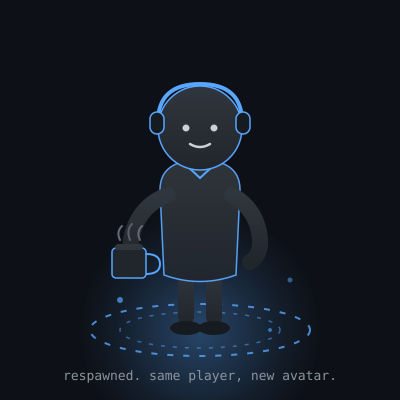

 

Final-year IT student from South Africa 🇿🇦, building full-stack apps and leaning into AI/ML.

**About me**
- 🎓 Honours student researching **blockchain & consent management in healthcare**
- 🛠️ Building **Smart Vitals** (health monitoring) and a gamified 3D portfolio
- 🤖 Rebuilding this profile to be a game-like, interactive one, slow going mostly because my AI keeps hallucinating and I keep running out of credits 😉
- 🕹️ Join my lobby: [LinkedIn](https://www.linkedin.com/in/sfundo-khumalo-243313249) · [Email](mailto:sudosfundo01@gmail.com) · [Portfolio](https://portfolio-10u5.onrender.com)

📅 Monthly wraps

 

| Month | Learned | Building | Next month target |
| --- | --- | --- | --- |
| August 2026 | _add what you picked up this month_ | _add what you're working on_ | _add your target for September_ |

Add a new row on top each month, keep the old ones below as a running log.

🎮 Patch notes: why this profile respawned

 

This profile didn't used to look like this. A lot's changed since I first put it together, and I've grown enough to rebuild it, part rethink, part promise kept to my grade-10 self who picked IT as a subject with no idea where it would go.

- Still learning, still growing. The aim was never squashing as many bugs as possible; it's to build, vibe code, and get a little better each day. Cliché, and hard to be held accountable for by anyone but myself. Wink wink.
- Joke's on you: I just spawned into this new lobby with a new avatar. Same person holding the joystick.
- New environment, still under construction, still designing on pen and paper, in Obsidian, and now with Claude in the loop.
- The real goal: update this monthly with what I learned and what I'm targeting next, so I'm not just accountable to myself anymore, you are too.
- Trying to gamify this whole experience outside GitHub too, chasing non-trivial, achievable goals under self-set rules, choice feeling entirely mine. Moving slower than I'd like, but one day I'll spawn in my own environment, built line by line, and you'll get to feature in it too.
- Problem statement and user stories: done. That's progress.
- Scrubs and gloves on: AI-fying my existing repos this year. Everyone's doing it and it's the current buzz, sure, but mostly I'm in it because it's genuinely exciting and I want to learn.
- Enjoying my UCL run this season, but it's quarter-final time now.
- As an Honours student, my blockchain-in-healthcare research paper is eating a lot of my dev time.
- Still squashing bugs and shipping features daily through work-integrated learning, just not always on the projects that make me feel like prime Ronaldinho, Messi, or Peter Parker with a supercar. Those are coming.
- Research design stage of my blockchain consent-management framework: ~90% there. The last 10% takes about as long as the first 90% did. Some crazy, true law.
- "Ice Cole," yes, that's a Cole Palmer reference. A few more hidden refs are scattered through here if you want to go looking, that's basically why I love IT, dev life, software engineering, whatever you want to call it. We wear a lot of hats in this space, reach out on LinkedIn, email, or through my portfolio.
- The obstacles are the fun part. Pressing the up arrow, pressing W, that feels good, and staying comfortable is boring. That's why I keep playing, growing, learning. This is the game.
- Starting to think about physical AI, so don't be surprised if IoT devices and things like the NVIDIA DGX Spark start showing up here too.

 

📊 Full stats, tech stack & trophies

 

**Tech Stack**

          
     
                              

---

---

**GitHub Stats**

---

**🏆 Trophies**

---

**✍️ Random Dev Quote**

---

